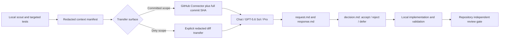

# ChatGPT Pro Consultation Workflow

> Status: active advisory workflow. This document does not modify or replace
> `docs/INDEPENDENT_REVIEW_GATE.md`.

## Purpose

Use ChatGPT Pro for high-impact judgment, then keep Codex/local tooling responsible for facts, implementation,
validation, and formal review. The workflow is designed for architecture, consequential kickoff, difficult debugging,
contract-heavy approach review, and milestone audit. Routine edits and lightweight documentation checks should not be
escalated.

The reusable personal skill is `$consult-chatgpt-pro`.

## Authority model

| Layer | Owner | What it may establish |
| --- | --- | --- |
| Local scout and tests | Codex/local tools | Current files, dirty diff, runtime behavior, exact validation |
| ChatGPT Pro consultation | Advisory reviewer | Architecture critique, missing risks, recommended sequence |
| Decision artifact | Implementation owner | Accepted, rejected, and deferred advice with evidence |
| Repository independent review | Non-author canonical runner | Formal scoped `GO` or `NO-GO` |

Pro output is never CI evidence, formal review, legal/privacy approval, security signoff, live-provider approval, or
milestone signoff.

## Workflow



### 1. Scope gate

Choose one primary purpose:

- `kickoff` for a not-yet-started slice;
- `architecture` for a concrete owner/boundary/source-of-truth decision;
- `approach_review` for in-progress work;
- `critical_debug` for a difficult causal failure;
- `milestone_audit` before a material handoff.

Other applicable question sets may be secondary. Do not use Pro merely because it will always find another cosmetic
issue.

### 2. Redacted context

Separate verified facts, inferences, and unknowns. Include the objective, constraints, affected contracts, exact file
scope, validation already run, and bounded questions. Exclude credentials, OAuth/session data, cookies, `.env`, private
personal data, system/developer instructions, and irrelevant logs. Do not persist an unredacted draft.

### 3. Browser and UI contract

When the user selects Codex's in-app browser, use its dedicated in-app binding. Do not silently fall back to Chrome.
Chrome is a separate surface and requires an explicit user choice.

Verify before every send:

```text
Surface: Chat
Model: GPT-5.6 Sol
Mode: Pro
```

`Work / Ultra` is not a substitute. If any observed value is unavailable, mark `blocked_pre_send` rather than inventing
success metadata.

### 4. GitHub Connector handshake

Use Connector read-only. Attach it through the lower-left composer entry before the message that needs repository
access. The blue check in the menu and the GitHub chip in the composer prove UI selection; an actual repository tool
step proves callable access.

The full commit SHA is the content authority. Record repository, requested SHA, observed SHA, and every required file.
Each file must be complete and attributable to the observed SHA. A mutable branch is provenance metadata:

- exact commit and all files proven, branch lookup unavailable: continue with
  `branch_verification=connector_unavailable`;
- commit unavailable/mismatched or file missing/truncated: `blocked_connector`, no verdict;
- committed Connector scope never implies visibility into local dirty files.

Do not ask Connector to create issues, Epics, commits, PRs, or other writes unless the user separately authorizes that
external action.

### 5. Long-run interaction

Use one structured prompt. Do not create unattended scraping or frequent polling around a personal ChatGPT session.
Check after a meaningful interval or visible completion signal, then extract the response once. Require exact
`BEGIN_ARTIFACT` and `END_ARTIFACT` markers so Codex can persist the result without relying on file upload support.

### 6. Durable artifacts

Store each consultation under:

```text
docs/pro-consults/YYYY-MM-DD-<slug>/
  request.md
  response.md
  decision.md
  metadata.json
```

`response.md` preserves the extracted Pro result. `decision.md` records `accepted`, `rejected`, and `deferred` items
with local evidence. `metadata.json` records required/observed UI state, browser surface, redaction, commit/file proof,
dirty-scope visibility, completeness, schema validity, and request/response hashes.

The GitHub Connector is a reader, not the local artifact writer. Codex writes and validates these files, then commits
them through the normal repository workflow.

### 7. Decision and validation

Keep Pro's raw verdict. Codex normalizes only exact `keep`, `adjust`, or `pivot`; any other label, including `GO`, maps
to `null` and makes the response schema-invalid. Confidence does not replace evidence.

For every accepted P0/P1 recommendation, record the fix and an exact regression command. Reject advice that conflicts
with current owner decisions or repository contracts. Defer live/provider/schema/canonical-writer scope until its
explicit gate is satisfied.

## Validated lessons from 2026-07-14

1. The old conversation showed a GitHub chip but had no callable tool. A fresh first message with Connector enabled
   produced an actual repository metadata tool step.
2. Requiring a separate mutable branch lookup caused a false block even after the exact commit and files were retrieved.
   The immutable SHA is now authoritative; branch lookup is metadata.
3. In-app browser and Chrome bindings must be explicit. Reusing an existing Chrome control session is browser drift.
4. File upload is unnecessary for committed scope: Connector reads the pinned commit, while bounded text/artifact
   markers cover local context.
5. Independent subagent review still matters. In Track C C1a it caught empty-terminal-timeline and history-error race
   defects after the first green targeted suite; both were fixed before the pinned commit.

## Exit criteria

A consultation is complete only when the response markers are intact, requested/observed scope is recorded, the
decision artifact is written, and accepted items have local validation. Formal gates remain pending until the canonical
non-author runner produces matching hash-bound evidence.
