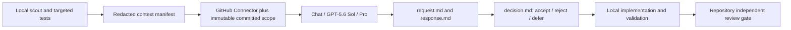

# ChatGPT Pro Consultation Workflow

> Status: active advisory workflow. This document does not modify or replace
> `docs/INDEPENDENT_REVIEW_GATE.md`.

## Purpose

Use ChatGPT Pro for high-impact judgment, then keep Codex/local tooling responsible for facts, implementation,
validation, and formal review. The workflow is designed for architecture, consequential kickoff, difficult debugging,
contract-heavy approach review, and milestone audit. Routine edits and lightweight documentation checks should not be
escalated.

The reusable personal skill is `$consult-chatgpt-pro`.

## Authority model

| Layer | Owner | What it may establish |
| --- | --- | --- |
| Local scout and tests | Codex/local tools | Current files, dirty diff, runtime behavior, exact validation |
| ChatGPT Pro consultation | Advisory reviewer | Architecture critique, missing risks, recommended sequence |
| Decision artifact | Implementation owner | Accepted, rejected, and deferred advice with evidence |
| Repository independent review | Non-author canonical runner | Formal scoped `GO` or `NO-GO` |

Pro output is never CI evidence, formal review, legal/privacy approval, security signoff, live-provider approval, or
milestone signoff.

## Workflow



### 1. Scope gate

Choose one primary purpose:

- `kickoff` for a not-yet-started slice;
- `architecture` for a concrete owner/boundary/source-of-truth decision;
- `approach_review` for in-progress work;
- `critical_debug` for a difficult causal failure;
- `milestone_audit` before a material handoff.

Other applicable question sets may be secondary. Do not use Pro merely because it will always find another cosmetic
issue.

### 2. Redacted context

Separate verified facts, inferences, and unknowns. Include the objective, constraints, affected contracts, exact file
scope, validation already run, and bounded questions. Exclude credentials, OAuth/session data, cookies, `.env`, private
personal data, system/developer instructions, and irrelevant logs. Do not persist an unredacted draft.

Before sending, build an allowlist of the exact paths/scopes being transferred and run the versioned secret/deny-path
preflight. Persist only its rule version, request hash, allowlist result, excluded-category counts, and total match count;
never persist matching values. `redaction_status=verified` is invalid without this evidence. Distinguish
`dirty_changed_files_inventory_status=not_recorded` from a verified empty dirty inventory.
The preflight allowlist must equal the machine-readable Connector scope below. The bundle validator reruns the request
scan and reconstructs the exact committed files or diff through local Git, verifies the changed-file inventory, scans
that content, and compares the recorded transfer hash instead of trusting a `passed` flag. File mode accepts Git blobs,
not trees or submodules. Diff mode uses the same merge-base three-dot range as the GitHub compare URL and literal
pathspecs. The scanner decodes common JSON/Markdown/URL escape forms before matching. It also requires exactly four
regular bundle files and scans every directory entry; a secret-like value makes `storage_valid=false`, including with
`--allow-invalid-storage`.

These are the repository's executable checks. `preflight-request` is mandatory immediately before the browser send; it
derives the allowlist from `CONNECTOR_SCOPE_JSON`, binds the request headers to that immutable scope, verifies the local
GitHub origin, reconstructs and scans the exact committed payload, and exits non-zero on any contradiction:

```bash
PYTHONPATH=src .venv/bin/python scripts/pro_consultation_contract.py preflight-request \
  docs/pro-consults/<date-slug>/request.md
PYTHONPATH=src .venv/bin/python scripts/pro_consultation_contract.py validate-bundle \
  docs/pro-consults/<date-slug>
```

`redaction-scan` remains available for drafting diagnostics, but it does not replace the exact committed-content
pre-send gate.

The bundle command exits zero only for a usable consultation. Use `--allow-invalid-storage` solely to audit that a
legacy/incomplete capture is honestly classified and safe to retain; it does not make that capture usable.

### 3. Browser and UI contract

When the user selects Codex's in-app browser, use its dedicated in-app binding. Do not silently fall back to Chrome.
Chrome is a separate surface and requires an explicit user choice.

Verify before every send:

```text
Surface: Chat
Model: GPT-5.6 Sol
Mode: Pro
```

`Work / Ultra` is not a substitute. If any observed value is unavailable, mark `blocked_pre_send` rather than inventing
success metadata.

Every request repeats the machine-checked header fields `Purpose`, `Secondary question sets`, `Authority`,
`Surface required`, `Model required`, `Mode required`, `Browser required`, `Local state`,
`Connector sees dirty scope`, `Dirty scope provided to Pro`, `Branch`, `Branch requirement`, `Repository`,
`Commit authority`, `Consultation status`, `Connector status`, and `Redaction status`. Before send,
`Consultation status` is exactly `planned`; Connector-backed requests use `attached_pending`, while `unused` scope uses
`unused`. Duplicate or contradictory header lines fail validation.

### 4. GitHub Connector handshake

Use Connector read-only. Attach it through the lower-left composer entry before the message that needs repository
access. The blue check in the menu and the GitHub chip in the composer prove UI selection; an actual repository tool
step proves callable access.

The full commit SHA is the content authority. Record repository, requested SHA, observed SHA, and every required file.
Each file must be complete, attributable to the observed SHA, and have a durable Connector proof reference. Declare
`branch_requirement=provenance_only|required` before the request. Branch lookup is not a default content gate: use
`provenance_only` unless the branch head itself is material to the question. Preserve the raw lookup result as `verified`,
`not_found`, `lookup_unsupported`, `resolved_other_sha`, or `not_requested`; never rewrite `not_found` as unavailable.

Every v2 request contains exactly one compact JSON line. It is the source of truth for proof mode and required scope:

```text
CONNECTOR_SCOPE_JSON: {"commit_sha":"<40-hex>","mode":"files","repository":"owner/repo","required_files":["/AGENTS.md"]}
CONNECTOR_SCOPE_JSON: {"base_sha":"<40-hex>","changed_files":["/exact/path"],"head_sha":"<40-hex>","mode":"diff","repository":"owner/repo"}
CONNECTOR_SCOPE_JSON: {"mode":"unused"}
```

File mode requires an exact one-to-one proof set for `required_files`; diff mode requires a base/head-bound diff proof
and an exact `changed_files` inventory equal to `git diff --name-only <base>...<head>`. Every absolute repository path
mentioned in the request must belong to this manifest; `unused` mode permits none.
The modes cannot be mixed, and `blocked`/missing evidence never validates a Connector-required request.
Each proof uses the exact immutable GitHub URL: `.../blob/<full-sha>/<path>` for a file or
`.../compare/<base>...<head>` for a diff. The repository must equal the local GitHub `origin`, and each exact citation
must also occur as unfenced text in the extracted Pro response. A fenced example, truthy label, or conversation URL is
not a durable content citation.

For `provenance_only`, a non-verified branch outcome does not invalidate otherwise proven commit content, but the
workflow must not claim branch verification. For `required`, anything except `verified` blocks the consultation:

- exact commit/file proof missing, mismatched, truncated, or uncited: `blocked_connector`, no grounded verdict;
- a `verified` branch must record the same resolved full SHA; `resolved_other_sha` must preserve the distinct SHA;
- committed Connector scope never implies visibility into local dirty files. Contract v2 inventories local dirty paths
  but requires `connector_sees_dirty_scope=false`, `dirty_scope_provided_to_pro=false`, and null dirty transfer/hash.
  Supporting an explicit dirty-content transfer requires a later contract version and is not inferred from prompt text.

Do not ask Connector to create issues, Epics, commits, PRs, or other writes unless the user separately authorizes that
external action.

### 5. Long-run interaction

Use one structured prompt. Do not create unattended scraping or frequent polling around a personal ChatGPT session.
Check after a meaningful interval or visible completion signal, then extract the response once. Require exact
`BEGIN_ARTIFACT` and `END_ARTIFACT` markers so Codex can persist the result without relying on file upload support.

### 6. Durable artifacts

Store each consultation under:

```text
docs/pro-consults/YYYY-MM-DD-<slug>/
  request.md
  response.md
  decision.md
  metadata.json
```

`response.md` preserves the complete marker envelope, not only the body. Its exact unfenced lower-case verdict is one
of `Raw Pro verdict: keep|adjust|pivot`; its headings are ordered, and `## P0`, `## P1`, and `## P2` live inside
`# Findings`. The advisory label immediately follows `BEGIN_ARTIFACT`; blockquoted/fenced/duplicate verdicts do not
count. `decision.md` uses ordered `# Decision`, `## Authority`, `## Local disposition`, and `## Follow-up`
sections and never claims formal or independent-review approval. `## Local disposition` contains exactly one reasoned
`P0 disposition`, `P1 disposition`, and `P2 disposition` plus one non-empty `Validation` record; `## Follow-up` is
non-empty. `metadata.json` records required/observed UI state, browser surface,
redaction preflight, commit/file proof, raw branch outcome, dirty-scope visibility, completeness, schema validity,
request/response/decision hashes, transfer-content preflight, retention safety, schema version, and the repository-owned
workflow and validator hashes. Personal skill/reference hashes are intentionally not accepted as evidence because they
are outside the repository authority boundary.

Derive one final validity result. `consultation_status=complete_validated`, `consultation_valid=true`, and
`usable_for_advisory_decision=true` are allowed only when UI state, redaction preflight, marker envelope, response
schema, exact committed-content scan, commit/diff proof, and every required Connector citation all validate. A captured response may still be stored
as `legacy_advisory_unverified` or `incomplete`, but it is not Connector-grounded decision evidence. Connector access
success and consultation validity are separate facts. The validator also enforces `advisory_only=true`,
`formal_gate_eligible=false`, `formal_review_status=not_run`, the required response headings/verdict grammar, and the
current workflow and validator hashes. Required and observed browser/UI metadata are both exact:
`Chat / GPT-5.6 Sol / Pro / Codex in-app browser`.
Unknown v2 metadata fields fail closed, and metadata/status coherence is part of `consultation_valid`, not merely a
storage warning.

The GitHub Connector is a reader, not the local artifact writer. Codex writes and validates these files, then commits
them through the normal repository workflow.

### 7. Decision and validation

Keep Pro's raw verdict. Codex accepts only exact lower-case `keep`, `adjust`, or `pivot`; any other label, including `GO`, maps
to `null` and makes the response schema-invalid. Confidence does not replace evidence.

For every P0/P1/P2 level, record `accepted|rejected|deferred|none` and the reason. For every accepted P0/P1
recommendation, record the fix and an exact regression command in `Validation`. Reject advice that conflicts with
current owner decisions or repository contracts. Defer live/provider/schema/canonical-writer scope until its explicit
gate is satisfied.

## Validated lessons from 2026-07-14

1. The old conversation showed a GitHub chip but had no callable tool. A fresh first message with Connector enabled
   produced an actual repository metadata tool step.
2. Requiring a provenance-only mutable branch to resolve caused a false content block after the exact commit and files
   were retrieved. The immutable SHA is content authority, but `not_found`, `lookup_unsupported`, and
   `resolved_other_sha` stay distinct and a required branch still fails closed.
3. In-app browser and Chrome bindings must be explicit. Reusing an existing Chrome control session is browser drift.
4. File upload is unnecessary for committed scope: Connector reads the pinned commit, while bounded text/artifact
   markers cover local context.
5. Independent subagent review still matters. In Track C C1a it caught empty-terminal-timeline and history-error race
   defects after the first green targeted suite; both were fixed before the pinned commit.

## Exit criteria

A consultation is complete only when the response markers are intact, requested/observed scope and Connector proof are
recorded, the mandatory pre-send and persisted-bundle scans are hash-bound, the directory contains exactly the four
regular contract files, the persisted bundle is retention-safe, the computed contract result is valid, the decision artifact is
written, and accepted items have local validation. Formal gates remain pending until the canonical non-author runner
produces matching hash-bound evidence.
